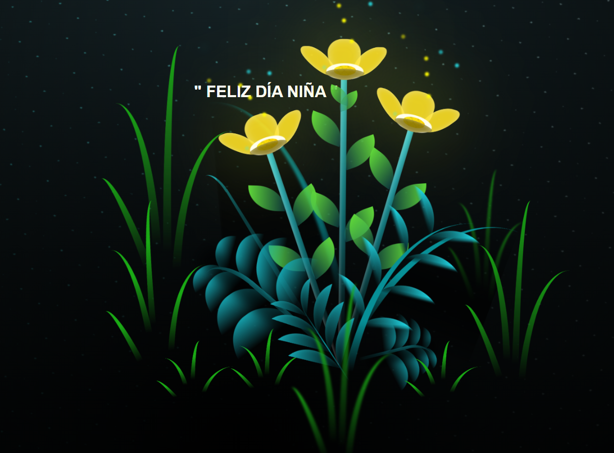

# 🌻 Flowers.io - Sorpresa Floral Interactiva

Una hermosa página web interactiva que presenta animaciones florales impresionantes acompañadas de música clásica. Perfecta para sorprender a alguien especial.

<p align="center">
  
</p>

## 📋 Descripción

Flowers.io es un proyecto web que combina CSS3 puro con JavaScript para crear una experiencia visual cautivadora. Presenta múltiples flores animadas que florecen elegantemente en la pantalla, acompañadas por una canción romántica de La Oreja de Van Gogh.

**Caso de uso ideal**: ¡Sorprende a tu novia, esposa o persona especial con esta experiencia romántica y visual!

## 🎨 Características Principales

- **Flores Animadas en CSS**: Flores completamente diseñadas con CSS puro sin imágenes
- **Efectos de Luz**: Animaciones de luz parpadeante que simulan brillo en los pétalos
- **Fondo Nocturno**: Escena de noche estrellada como contexto
- **Música Integrada**: Audio automático de "Rosas" - La Oreja de Van Gogh
- **Controles Interactivos**: Botón de reproducción/pausa para la música
- **Animaciones Suaves**: Transiciones y animaciones CSS fluidas
- **Diseño Responsivo**: Compatible con diferentes tamaños de pantalla
- **Efecto de Profundidad**: Múltiples capas de flores con diferentes estilos

## 📁 Estructura del Proyecto

```
Flowers.io/
├── index.html              # Página principal
├── css/
│   ├── main.css           # Estilos principales
│   └── style.css          # Estilos adicionales
├── img/
│   └── flowers.png        # Icono del proyecto
├── sound/
│   └── La Oreja de Van Gogh - Rosas [Letra].mp3  # Música de fondo
├── anim.js                # Lógica de animaciones
├── main.js                # Script principal
└── README.md             # Este archivo
```

## 🚀 Cómo Usar

### Opción 1: Abrir Localmente
1. Descarga o clona el repositorio
2. Abre el archivo `index.html` directamente en tu navegador
3. ¡Disfruta de la experiencia! 🌸

### Opción 2: Usar en Servidor Local
```bash
# Si tienes Python 3 instalado
python -m http.server 8000

# Si tienes Node.js con http-server
npx http-server

# Luego accede a http://localhost:8000
```

## 🎮 Interactividad

- **Botón de Reproducción (▶)**: Controla la música de fondo
  - Haz clic para reproducir o pausar la canción
  - El botón está ubicado en el centro de la pantalla
  - Tiene efecto hover visual

- **Experiencia Visual**:
  - Las flores se animan automáticamente
  - Los pétalos se mueven y respiran
  - Las luces parpadean creando un efecto mágico
  - El mensaje personalizado aparece en la parte superior

## 🛠️ Tecnologías Utilizadas

- **HTML5**: Estructura semántica de la página
- **CSS3**: 
  - Animaciones CSS puras
  - Transformaciones 2D
  - Efectos de sombra y brillo
  - Transiciones suaves
- **JavaScript Vanilla**: 
  - Control de audio
  - Lógica de interactividad
  - Sin dependencias externas

## 🎨 Personalización

### Cambiar el Mensaje
Edita la línea en `index.html`:
```html
<h1 id="title">" FELIZ DÍA NIÑA "</h1>
```
Cambia el texto por tu mensaje personalizado.

### Cambiar la Música
Reemplaza el archivo de audio en la carpeta `sound/` y actualiza:
```html
<audio id="miAudio" src="sound/tu-cancion.mp3" autoplay></audio>
```

### Personalizar Colores
En los archivos CSS (`main.css` y `style.css`):
- Modifica los colores de los pétalos
- Ajusta los tonos de las luces
- Personaliza el fondo

### Ajustar Animaciones
En `anim.js` y `main.js`:
- Modifica la velocidad de las animaciones
- Cambia la duración de los movimientos
- Ajusta los efectos de rotación

## 📱 Requisitos del Navegador

- Navegador moderno con soporte CSS3
- Chrome, Firefox, Safari o Edge (versiones recientes)
- JavaScript habilitado
- Soporte para HTML5 Audio

## 🎵 Audio

- **Canción**: "Rosas" - La Oreja de Van Gogh
- **Formato**: MP3
- **Reproducción**: Automática al cargar la página
- **Control**: Botón de play/pausa en el centro

## 💡 Consejos de Uso

1. **Para sorprender**: Comparte el enlace a través de un mensaje de WhatsApp o correo
2. **Pantalla completa**: Presiona F11 en tu navegador para una experiencia inmersiva
3. **Volumen**: Asegúrate de que el volumen sea adecuado
4. **Luz ambiente**: Disfruta mejor en un lugar oscuro o con poca iluminación

## 📸 Vista Previa

- Múltiples flores con pétalos animados
- Efectos de brillo parpadeante
- Tallo y hojas con movimiento sutil
- Fondo nocturno estrellado
- Mensaje personalizado que captura atención

## 🎬 Tutorial

Si deseas aprender cómo se hizo este proyecto, consulta el video tutorial:
📺 [Tutorial en YouTube](https://youtu.be/ZSSOiJaMIk0)

## 🌟 Características Técnicas Avanzadas

### Animaciones CSS
- `@keyframes` para movimientos fluidos
- Transformaciones con `transform`
- Transiciones con `transition`
- Pseudo-elementos para efecto de luz

### Estructura de Flores
- Pétalos creados con divs y CSS border
- Hojas del tallo animadas
- Luces simuladas con sombras radiales
- Capas múltiples para profundidad

## 🔧 Solución de Problemas

### La música no suena
- Verifica que el archivo `.mp3` está en la carpeta `sound/`
- Comprueba que JavaScript está habilitado
- Intenta actualizar la página (Ctrl + F5)

### Las flores no se animan
- Asegúrate de que CSS está cargado correctamente
- Verifica que los archivos en `css/` existen
- Abre la consola del navegador (F12) para ver errores

### Problema de visualización
- Actualiza el navegador
- Borra el caché (Ctrl + Shift + Del)
- Prueba en otro navegador

## 👤 Autor

Proyecto creado como parte del portfolio de Whoamy2p.

## 📄 Licencia

Este proyecto es de código abierto y puede ser modificado libremente para uso personal.

---

⭐ Si este proyecto te encanta, comparte la experiencia y sorprende a alguien especial.

**Creado con ❤️ para sorpresas románticas**
